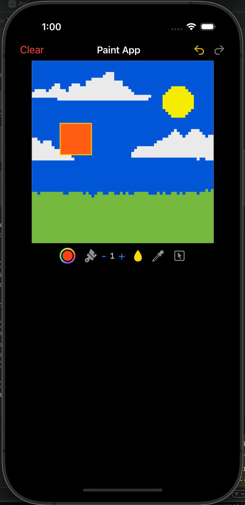

# MSPaintClone
# PaintApp 🎨

A super-lightweight open-source **MS Paint-style app** written entirely in **SwiftUI**, built for iPhone and iPad.  
Draw pixels, fill areas, pick colors, and select regions — all rendered in real time with a minimal and efficient design.

---

## Features

- **Brush Tool** — smooth circular brush with adjustable size  
- **Bucket Fill** — instant flood fill by color or selection  
- **Eyedropper** — tap any pixel to sample its color  
- **Selection Tool** — box-select regions for targeted fills  
- **Undo / Redo** stack (up to 50 actions)  
- **Color Picker** integrated directly into the toolbar  
- Works on both **iPhone and iPad**, no dependencies, no Storyboards  

---

## Screenshot

---

## Technical Notes

- Built using **SwiftUI** and pure **Swift**, no external libraries.  
- Canvas implemented via `Canvas { ctx, size in ... }` for fast pixel rendering.  
- Every pixel stored as a 32-bit ARGB integer (`UInt32`).  

---

## Running

1. Clone or download this repo.  
2. Open `PaintApp.xcodeproj` in **Xcode+**.  
3. Run on any **iOS 14+** simulator or physical device.  

---

## Structure

| File | Purpose |
|------|----------|
| `PaintAppView.swift` | Main app view (toolbar + canvas), Canvas rendering and gesture logic, Converts between `Color` and ARGB UInt32 |
| `README.md` | Project description |

---

## License

This project is released under the **MIT License** — free for personal and commercial use.  
Feel free to fork, remix, or integrate it into your own apps.

---

